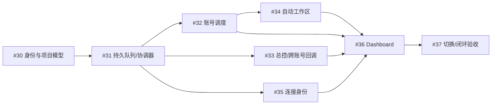

# 多账号 ChatBridge 与自动工作区实施计划

**Goal:** 用户按业务项目/子项目和总控组织任务，由 Bridge 自动选择账号、管理 Agent Space、持久排队并精确回收结果。

**Architecture:** 沿用已有 Ego 浏览器 worker，加入单一本机协调入口与 SQLite 状态/投递存储。业务项目、真实账号、总控/工作会话与可恢复的浏览器附件分别建模；ChatGPT Computer 提供稳定来源账号映射及三页 dashboard。

**Tech Stack:** 现有 Zsh CLI、JavaScript/Ego browser API、Python 3；协调与 SQLite 优先使用 Python 标准库以兼容 Bridge 的 Node >=20 基线。电脑连接端沿用 Node >=22、TypeScript 和现有无框架 Mac dashboard。

**状态（2026-09-26）:** 两个仓库已完成第一轮本地实现与自动化测试；ChatGPT Computer DMG 已构建，但未安装/切换当前服务。HZ OS 在 hzcodex 的旧绑定复用了 Ru Wang 的 Project ID，最近一次 hzcodex Space 记录没有 HZ OS Project；此外该 Ego Space 已由用户接管。未核实新 Project/Profile 和获得明确继续浏览器操作指示前，不进行 hzcodex 实际迁移或跨账号闭环验收。当前 Ru Wang 的在途任务不迁移。生产状态与未完成验收见 [#37](https://github.com/luxiaolei/chatgpt-chat-bridge/issues/37)。

**执行方式:** 依赖顺序逐单实现；执行时可使用本机 `executing-plans` skill。每单先核对现有实现，再编写该行为的必要回归测试、做最小修改、完成该单验收。不要将本计划中的“预期结果”写成已经验证的事实。

**计划日期:** 2026-09-25

**GitHub 总单:** https://github.com/luxiaolei/chatgpt-chat-bridge/issues/29

**工作区:**
- ChatBridge：`/Users/xlmini/Projects/chatgpt-chat-bridge`
- ChatGPT Computer：`/Volumes/extdisk/MyRepos/chatgpt-open-remote-mcp`
- 两个仓库均有已有未提交改动。当前规划阶段只新增本计划，不提交/覆盖这些代码，不改变正在运行的连接或 watcher。
- Issues 统一存放在 `luxiaolei/chatgpt-chat-bridge`；电脑连接仓库未启用 Issues，其工作仍按子单注明的仓库实施。

---

## 固定产品约定

1. HZ OS 类型的父项目可含多个工作组与各自总控，它们可共用一个实际 ChatGPT Project。
2. Quant Company 类型的业务项目可把不同 research chats 分配至多个账号的实际 Project。
3. 用户的 Manual Space 日常使用方式不变；系统按需管理托管 Agent Space 和页面，首版不建立复杂动态 Space 池。
4. 已有 task/session 的账号与 Chat 固定；新工作才按项目允许账号池分配。跨账号结果回到固化的具体总控引用。
5. 调度器负责输送、资源与恢复；总控负责业务决策，GitHub/项目资料保持业务成果真源。持久队列不能作为可丢弃缓存。
6. 显示名不参与路由；来源账号不等于来源 Chat/Project，登记的总控必须在调用中带 callerRef。
7. UI lease 与 Chat 活跃任务独占分别管理；模型长生成期间释放账号 UI lease。同账号下所有项目负载合并计算。
8. 接收请求、发送确认、回答就绪、回调完成、业务验收是不同状态。发送不确定时先核查，不承诺无法证明的远端 exactly-once。
9. 默认配置变更仅影响后续新任务；旧账号别名保留兼容，合并账号时保留全部 Chat 与任务引用。
10. 服务在本机运行；此次不扩展至云部署、多机集群或新的屏幕权限。

## 执行阶段和依赖

| 阶段 | 任务 | 前置条件 | 阶段出口 |
|---|---|---|---|
| 0 | 基线清点、现有改动审查、预演数据 | 无 | 明确本地/已安装/远端版本，不覆盖用户改动 |
| 1 | CB-01 → CB-02 | 基线就绪 | 稳定身份模型、事务状态、持久 operation |
| 2 | CB-03 / CB-04 / CB-06 | CB-02 契约稳定 | 队列调度、精确回调、稳定来源可联测 |
| 3 | CB-05 | CB-03 | 托管 Space 自动复用/恢复、Manual 保护 |
| 4 | CB-07 | CB-03/04/05/06 | 三页控制台读写真实状态 |
| 5 | CB-08 | 全部前置子单 | 真实闭环、发布、安装、回滚证据齐全 |

## GitHub 任务索引

| 编号 | 优先级 | Issue | 实施仓库 | 依赖 |
|---|---|---|---|---|
| CB-01 | P0 | [#30 统一真实账号身份、业务项目/子项目和执行位置模型](https://github.com/luxiaolei/chatgpt-chat-bridge/issues/30) | luxiaolei/chatgpt-chat-bridge | 无 |
| CB-02 | P0 | [#31 建立本机协调服务与 SQLite 持久队列，统一状态写入](https://github.com/luxiaolei/chatgpt-chat-bridge/issues/31) | luxiaolei/chatgpt-chat-bridge | CB-01 |
| CB-03 | P0 | [#32 按真实账号排队、缩短 UI 锁并按全项目负载分配新任务](https://github.com/luxiaolei/chatgpt-chat-bridge/issues/32) | luxiaolei/chatgpt-chat-bridge | CB-02 |
| CB-04 | P0 | [#33 登记总控身份与项目上下文，实现跨账号精确回调](https://github.com/luxiaolei/chatgpt-chat-bridge/issues/33) | luxiaolei/chatgpt-chat-bridge | CB-02 |
| CB-05 | P1 | [#34 自动管理 Agent Space 与标签页，保护 Manual 并恢复重启](https://github.com/luxiaolei/chatgpt-chat-bridge/issues/34) | luxiaolei/chatgpt-chat-bridge | CB-03 |
| CB-06 | P0 | [#35 将电脑连接绑定到稳定账号，分离显示名称与来源路由](https://github.com/luxiaolei/chatgpt-chat-bridge/issues/35) | luxiaolei/chatgpt-open-remote-mcp（兼容修改 chatgpt-chat-bridge） | CB-02 |
| CB-07 | P1 | [#36 重做 dashboard：项目任务、账号资源与可编辑关系](https://github.com/luxiaolei/chatgpt-chat-bridge/issues/36) | luxiaolei/chatgpt-open-remote-mcp | CB-03, CB-04, CB-05, CB-06 |
| CB-08 | P1 | [#37 完成跨账号闭环验收、旧状态迁移、安装升级和回滚](https://github.com/luxiaolei/chatgpt-chat-bridge/issues/37) | 两个仓库；在 chatgpt-chat-bridge 统一记录证据 | CB-01, CB-02, CB-03, CB-04, CB-05, CB-06, CB-07 |

## 执行前的基线步骤

1. 分别记录两个仓库的 HEAD、status、diff；核对已安装 CLI/runtime 与本地源文件。不要只从远端 main 开始而丢掉本机已实现的 origin/space/macOS 增量。
2. 备份 registry/runtime/event 与 LaunchAgent 配置到明确路径，记录计数和版本；在临时副本上测试迁移。
3. 复用已完成的 #27 多账号选择、#3 分级控制路由、#7 页池等能力。#28 的显式 claim/release 作为相关问题核对，不能扩大为自动接管 Manual。
4. 在实施前冻结 CB-02 的 IPC/operation schema。可并行的工作按模块分工；共享文件修改由集成者协调。
5. 首个实施任务是 [CB-01](https://github.com/luxiaolei/chatgpt-chat-bridge/issues/30)。本计划不创建执行 Chat、不分派现有业务任务。

## CB-01: 统一真实账号身份、业务项目/子项目和执行位置模型

**Issue:** https://github.com/luxiaolei/chatgpt-chat-bridge/issues/30
**仓库:** luxiaolei/chatgpt-chat-bridge
**依赖:** 无

**目标:** 让业务项目、子项目/工作组、账号、ChatGPT Project、Profile、Space 和 Chat 各自有独立身份；账号别名和显示名不再被当作资源。

**涉及文件:**

- src/main.js（registry 归一化、resolveChat、bindingFor）
- src/space-catalog.js
- src/capacity-preflight.py
- src/web-preflight.py
- 新增 src/topology.js
- 新增 tests/topology.test.mjs；扩展 tests/space-catalog.test.mjs
- docs/architecture.md、docs/multi-account-capacity.md

**实施步骤:**

1. 先记录当前工作树和安装版本差异；保留尚未提交的 origin-routing、space-catalog 等改动，建立本任务最小可复用基线。
2. 定义稳定 accountId、businessProjectId、workgroupId、locationId、sessionRef；显示名称可修改，Project URL/ID 和账号归属独立保存；子项目首版仅实现当前需要的工作组层级。
3. location 关联真实账号、实际 ChatGPT Project 和可用 Profile；Space/page 为可重建运行附件。每个项目有允许账号池；工作组可继承并收窄。
4. 按已核实登录身份合并旧账号别名，但保留别名解析兼容。按具体 Chat 身份保留会话，不因账号去重而丢弃第二个 Space 里的 Chat。
5. 提供只读迁移预览：账号归并、缺失绑定、同名异 ID 项目、人工/托管 Space 待确认项、会话与任务引用计数；只读发现不能自动重绑。
6. 覆盖两种用例：一个 ChatGPT Project 下多个子总控；一个业务项目使用多个账号的不同 ChatGPT Project。新增、改名、停用配置只影响后续分配。

**验收条件:**

- [ ] 两个别名指向同一登录时只显示一个账号，已有两组 Chat/task 全部保留。
- [ ] 同名但不同实际 Project ID 不被自动合并；可明确归入同一业务项目。
- [ ] 一个业务项目可增减账号；一个工作组可关联独立总控；可在不改代码的情况下新增项目。
- [ ] 重命名账号、业务项目或 Space 不改变持久任务的目标 Chat；只读预览不访问/操作 ChatGPT。
- [ ] 缺失或冲突登录身份显示为待核实并排除新任务分配，不能被静默当成空闲资源。

**验证:** 新增拓扑/迁移语义测试，覆盖旧 registry v2 导入、别名、不同 Project ID、已有会话引用保留；运行 npm run check && npm test。

**范围:** 本单不切换正在运行的服务，不删除旧别名、Space 或远端 Chat。实际事务导入由 CB-02 提供，生产迁移由 CB-08 执行。

## CB-02: 建立本机协调服务与 SQLite 持久队列，统一状态写入

**Issue:** https://github.com/luxiaolei/chatgpt-chat-bridge/issues/31
**仓库:** luxiaolei/chatgpt-chat-bridge
**依赖:** [CB-01](https://github.com/luxiaolei/chatgpt-chat-bridge/issues/30)

**目标:** 调度提交后获得可查询 operationId，并在服务或 Ego 重启后保留排队任务；所有 Bridge 状态修改经过单一协调入口和事务。

**涉及文件:**

- 新增 src/coordinator.py、src/state-store.py、src/bridge-client.py（建议职责边界）
- bin/chat-bridge
- src/main.js（load/saveRegistry、load/saveRuntime 及任务状态写入）
- src/event-journal.js、src/web-preflight.py、src/capacity-preflight.py
- scripts/install.sh、scripts/install-watchdog.sh、scripts/uninstall-watchdog.sh
- 新增 tests/coordinator.test.mjs、tests/state-store.test.mjs

**实施步骤:**

1. 先锁定 IPC 和状态契约；推荐 Python 3 标准库 sqlite3 + 本机协调服务，沿用已有 Python 依赖，保留 Node >=20 的浏览器 worker 支持；不引入远端消息队列。
2. 实现事务 schema 和版本迁移；保存项目/账号/会话、operation、dispatch attempt、callback outbox、幂等请求键和事件。记录接受任务后立即持久化再回执。
3. 实现本机用户限定的 IPC、单实例锁、worker lease 和健康查询；桥接旧 CLI 至统一入口。状态读取可以使用只读投影，禁止新的双写权威源。
4. 把 JS 浏览器 worker 的状态修改改为向协调器提交带版本的结果；协调器不在浏览器等待期间持有数据库事务。
5. 提供 submit/status/cancel 的稳定返回值。区分 QUEUED、DISPATCHING、SENT、GENERATING、RESPONSE_READY、DELIVERY_UNKNOWN、FAILED/CANCELLED；业务任务 COMPLETE 仍由总控验收。
6. 实现旧 JSON 导入的备份、预演、计数与引用核对、重复导入保护；导出 JSON 只作兼容读取。通过同一事务完成接受请求、领取工作和登记回执。
7. 在不同崩溃点恢复：发送前可重新领取；可能已发送但无回执进入 DELIVERY_UNKNOWN，先核查目标 Chat，禁止直接重发。

**验收条件:**

- [ ] 两个账号同时提交任务不会丢记录；相同 requestId 不产生第二条调度。
- [ ] 服务在接受任务后重启仍能查到 operation；未发送任务恢复执行，不把队列丢失当成功。
- [ ] 发送后回执丢失不自动重复发消息；无法确定时有可见 DELIVERY_UNKNOWN 状态。
- [ ] 取消排队任务与停止正在生成的 Chat 是不同操作，CLI/UI 不混淆。
- [ ] 老版本命令有明确兼容返回；没有新旧 worker 绕过协调器并行写状态的路径。
- [ ] 备份和恢复测试能还原任务、回调、别名与全部会话归属。

**验证:** 使用独立临时目录和假浏览器 worker 做并发/故障注入测试，验证提交、领取、崩溃恢复和重复请求；运行 npm run check && npm test。

## CB-03: 按真实账号排队、缩短 UI 锁并按全项目负载分配新任务

**Issue:** https://github.com/luxiaolei/chatgpt-chat-bridge/issues/32
**仓库:** luxiaolei/chatgpt-chat-bridge
**依赖:** [CB-02](https://github.com/luxiaolei/chatgpt-chat-bridge/issues/31)

**目标:** 忙碌时返回可查询的排队回执；不同账号可独立推进，同一账号跨项目统一计量，长时间模型生成不霸占 UI 操作锁。

**涉及文件:**

- src/coordinator.py、src/state-store.py
- src/capacity-preflight.py、src/web-preflight.py
- bin/chat-bridge
- src/main.js（send/ask/watch、模型设置和网页操作边界）
- tests/capacity-preflight.test.mjs、tests/account-cooldown.test.mjs、tests/pacing.sh
- 新增 tests/scheduler.test.mjs

**实施步骤:**

1. 以 canonical accountId 汇总所有项目、别名、活跃 attempt、已预留名额和带时间戳的会话观察；陈旧缓存不能冒充实时空闲或真实额度。
2. 为账号建立有界、公平的操作队列，配置普通/重型操作间隔，沿用现有最低节奏和冷却；回调优先但普通任务也能获得执行机会。
3. 把网页事务限制为核实目标、设置模型、输入发送、核实接受等必要操作；回答生成期间释放账号 UI lease，同一 Chat 的任务 lease 继续保留。
4. 把 read/status/watchdog/recovery 统一进入调度器；ask 的等待不持有 UI lease，也不应长占连接层 shell 执行名额。
5. 新任务只在项目允许且已有有效实际 Project/Profile 绑定的账号间选择；排除未核实、禁接新任务、冷却和已达自动化并发上限的账号。
6. 续接和明确目标 Chat 始终保持原账号；单次显式账号覆盖只对本次生效。并发限制为本机调度策略，不宣称是 ChatGPT 官方额度。
7. 失败回退有次数/时限，冷却到期重新检查。UI_LOCK_BUSY 成为内部等待原因，不再要求总控反复盲重试。

**验收条件:**

- [ ] 两个真实账号可同时推进；同一账号的多个别名和项目仍共享 UI 操作序列及负载。
- [ ] 一个长生成中的 Chat 不阻止同账号另一个 Chat 获得短 UI 操作机会；同一 Chat 不能接收两个活跃任务。
- [ ] 新任务同时到达时名额在事务中预留，不能全部看到相同空闲状态后超配。
- [ ] 某账号冷却不影响另一账号；已固定的任务不会被静默复制到另一账号。
- [ ] 队列显示当前原因、下一次可尝试时间和状态时间戳；不伪造服务端剩余额度/精确完成时间。
- [ ] 有限优先级调度不会让新派发或完成回调永久饥饿。

**验证:** 确定性假时钟/假 worker 验证跨项目负载、并发预留、长生成释放 UI lease、公平性、冷却隔离和固定会话；运行 npm run check && npm test。

## CB-04: 登记总控身份与项目上下文，实现跨账号精确回调

**Issue:** https://github.com/luxiaolei/chatgpt-chat-bridge/issues/33
**仓库:** luxiaolei/chatgpt-chat-bridge
**依赖:** [CB-02](https://github.com/luxiaolei/chatgpt-chat-bridge/issues/31)

**目标:** 总控登记后用稳定 callerRef/sessionRef 调度；已有任务回到原 Chat，子项目结果回到自己的子总控，跨账号工作也回到最初发起者。

**涉及文件:**

- src/control-routing.js、src/main.js（resolveChat、notifyController、task/new/send）
- src/coordinator.py、src/state-store.py、src/event-journal.js
- src/web-preflight.py、bin/chat-bridge
- skills/chat-bridge/SKILL.md、skills/project-conductor/SKILL.md、docs/conductor.md
- tests/control-routing.test.mjs、tests/origin-routing.test.mjs、tests/event-journal.test.mjs
- 新增 tests/controller-context.test.mjs

**实施步骤:**

1. 登记 root/subcontroller 的 sessionRef、业务项目、工作组及上级；自动创建的 Chat 自动登记，已有总控提供一次性登记方式并保存实际对话 ID。
2. callerRef/sessionRef 是路由上下文，不是认证密钥；来源账号仍由连接核对。CLI 可显式指定目标项目；否则从已登记 callerRef 推导，缺失则返回明确的上下文不足。
3. 目标解析优先采用 taskId/sessionRef 等已知目标，其次项目内角色；角色重名必须消歧。来源账号只是无明确目标时的默认偏好，不能覆盖已绑定目标。
4. 每个 task/attempt 在创建时固化 controllerSessionRef、replyToSessionRef 和 escalationSessionRef，避免以后改总控配置把在途回调改发。
5. 回调写入持久 outbox，由目标账号队列发送；目标忙、草稿或冷却时等待。上级升级遵守任务合同，不能因为稍慢就同时轰炸多级总控。
6. 总控/工作 Chat 的初始上下文和 skills 携带稳定引用及状态查询方法；重启恢复不再依赖重新解释项目关系。
7. 事件保持项目/账号可追踪与消费者游标兼容，回答就绪、回调成功、业务验收分别记录。

**验收条件:**

- [ ] 账号 A 的总控派任务到账号 B，结果只回到账号 A 的原总控；不会发给 B 的同名 conductor。
- [ ] 同一个实际 HZ OS Project 下的两个工作组分别回到自己的子总控，必要时才升级 root。
- [ ] 未提供目标 Project 时能从登记 callerRef 得到；只有来源账号或 Space 时不会猜 Project。
- [ ] 既有任务、回调在账号显示名/项目名变更和 Ego 重启后仍指向原 Chat。
- [ ] 回调重复提交或重启重放不会产生重复调度；发送不确定时进入核查状态。
- [ ] 同一总控正在生成或发现输入草稿时回调等待，不能覆盖。

**验证:** 双账号同名总控、单账号双工作组、未知 callerRef、忙碌回调和重启 outbox 测试；完整派发测试与 CB-03/CB-08 集成；运行 npm run check && npm test。

## CB-05: 自动管理 Agent Space 与标签页，保护 Manual 并恢复重启

**Issue:** https://github.com/luxiaolei/chatgpt-chat-bridge/issues/34
**仓库:** luxiaolei/chatgpt-chat-bridge
**依赖:** [CB-03](https://github.com/luxiaolei/chatgpt-chat-bridge/issues/32)

**目标:** 用户只保留日常 Manual 工作区；Bridge 复用正确 Profile，自动建立/复用托管工作 Space，恢复同一个 Chat 并管理有限标签页。

**涉及文件:**

- src/space-catalog.js、src/page-pool.js、src/main.js（openBoundTask、ensurePage、restore）
- src/coordinator.py、src/state-store.py
- tests/space-catalog.test.mjs、tests/page-pool.test.mjs
- 新增 tests/workspace-restore.test.mjs
- docs/architecture.md、skills/chat-bridge/SKILL.md

**实施步骤:**

1. 在 catalog 登记 profileId/profileName、已核实账号、Space ownership、manualProtected/managed 和最后检查时间；不要靠名称包含 Manual 或 profileName 等于账号名来证明身份。
2. 复用已登录且身份匹配的 Profile；缺少登录时标明需要登录。创建新的托管 Space 前检查已登记工作区，不因暂时故障反复新建。
3. 将业务 Chat 绑定与页面附件解耦。恢复时重查 Space/标签页、核实会话 ID 和账号，再附着到原 Chat；失效数字 ID/page label 不作为身份。
4. 在队列调度下按需打开页面；复用现有空闲回收逻辑，保护生成中、活跃任务、控制页面及草稿。关空闲标签不归档或删除远端聊天。
5. 后台不导航、不输入、不关闭 protected Manual 标签。若 Manual 与托管标签打开同一 Chat，仍遵守该 Chat 的忙碌/草稿保护，不能以分 Space 绕过。
6. 用户接管/交还、退出登录或账号变更时暂停相应操作并明确呈现；不自动强行夺回控制。
7. 重启后按持久队列和需要运行的会话逐步恢复，避免一次性打开所有历史标签。

**验收条件:**

- [ ] 用户不手工创建 Agent Space 即可为已就绪项目派发新工作；不会一 Chat 一 Space。
- [ ] Ego 重启后重新发现附件并回到相同对话 ID，没有重复 Space、Chat 或消息。
- [ ] 标签页预算满时仅回收安全空闲页，并可重新打开同一会话。
- [ ] Manual 草稿、人工打开的标签和正在生成的会话不被覆盖/关闭。
- [ ] Profile 登录与保存身份不一致时停用该位置；其他账号继续运行。
- [ ] #28 的 user takeover hard stop 保留；所有异常均有可见恢复状态。

**验证:** 使用假 Ego API 覆盖创建/复用、重启附件变化、profile 错配、页预算、人工接管；真实只读恢复与受控消息验收留给 CB-08；运行 npm run check && npm test。

## CB-06: 将电脑连接绑定到稳定账号，分离显示名称与来源路由

**Issue:** https://github.com/luxiaolei/chatgpt-chat-bridge/issues/35
**仓库:** luxiaolei/chatgpt-open-remote-mcp（兼容修改 chatgpt-chat-bridge）
**依赖:** [CB-02](https://github.com/luxiaolei/chatgpt-chat-bridge/issues/31)

**目标:** dashboard 显示真实 ChatGPT 账号名/可编辑简写；重命名连接或 Space 不再改变调度来源。

**涉及文件:**

- chatgpt-open-remote-mcp: macos/manager.mjs、macos/manager-core.mjs、macos/run-tunnel.sh
- chatgpt-open-remote-mcp: src/http-server.ts、src/diagnostics.ts、src/adapter/local-computer-adapter.ts
- chatgpt-open-remote-mcp: macos/manager.test.mjs、macos/manager-core.test.mjs、test/http.test.ts
- chatgpt-chat-bridge: src/web-preflight.py、bin/chat-bridge、tests/origin-routing.test.mjs

**实施步骤:**

1. 每个连接保存独立 displayName 和 canonical accountId；可从已核实账号中选择关联，来源 Space 仅保留诊断/旧配置迁移用途。
2. 旧配置按保存的 Space 登录记录预览迁移；映射不明确则显示待关联，不能按备注文字或当前前台页面猜。
3. 把稳定来源引用限定在单次请求上下文中传到本地 Bridge 调用，校验格式、解析绑定，并保留旧 origin Space 的受控过渡。
4. 未知来源不使用全局 default 静默回退；已登记 session/task 的目标路由仍按 CB-04 的规则，不受来源账号错误覆盖。
5. 账户名称只作显示，tunnel/connection 身份与映射不泄露凭据。来源引用是路由提示，不替代现有 MCP 认证/本机权限控制。
6. 维持现有文件、命令和屏幕权限设置；记录需要重启哪些连接的变更，区分本机 health/tunnel polling 与实际工具回执。

**验收条件:**

- [ ] 改账号简写、连接备注或 Space 名不会改变来源 canonical accountId。
- [ ] 同一账号多条连接/别名仍归到一个账号资源；不同账号请求并行时上下文不串。
- [ ] 缺失/未知/无效来源得到明确结果；不会在并发请求间泄露上一请求来源。
- [ ] 已有 Space-header 配置可以预览迁移、备份回退，无法验证的连接不冒充已绑定。
- [ ] dashboard 的连接在线只表示连接健康，单独显示工具回执验证时间。

**验证:** Mac manager/launcher 和 HTTP 请求隔离测试；Bridge origin-routing 兼容测试。MCP 运行 pnpm typecheck、pnpm exec tsx --test test/http.test.ts、node --test macos/*.test.mjs、pnpm build；全套平台适用测试在 CI 执行。

## CB-07: 重做 dashboard：项目任务、账号资源与可编辑关系

**Issue:** https://github.com/luxiaolei/chatgpt-chat-bridge/issues/36
**仓库:** luxiaolei/chatgpt-open-remote-mcp
**依赖:** [CB-03](https://github.com/luxiaolei/chatgpt-chat-bridge/issues/32)、[CB-04](https://github.com/luxiaolei/chatgpt-chat-bridge/issues/33)、[CB-05](https://github.com/luxiaolei/chatgpt-chat-bridge/issues/34)、[CB-06](https://github.com/luxiaolei/chatgpt-chat-bridge/issues/35)

**目标:** 中文 dashboard 以业务项目和任务为主；账号显示真实名字，Space/Profile 成为可展开运行详情，用户可以配置关系且看清实际等待原因。

**涉及文件:**

- macos/manager.html、macos/manager.mjs、macos/bridge-status.mjs
- macos/manager-ui.test.mjs、macos/manager.test.mjs、macos/bridge-status.test.mjs
- macos/README.md
- 消费 ChatBridge 协调服务的只读状态与配置变更接口，禁止直接写 registry/runtime

**实施步骤:**

1. 实现三个主视图：项目与任务、账号与资源、设置与诊断。项目详情显示子项目/工作组、总控、Chat 与队列；小型只读关系图作辅助。
2. 支持新增/改名/归档业务项目与工作组、登记总控、选择允许账号、关联账号下实际 ChatGPT Project；新发现项目进入待归类，同名不自动合并。
3. 账号卡片按稳定身份去重，显示真实登录名、可编辑简写、自动任务负载、排队、冷却、登录检查时间；Profile/Space/tunnel 在详情分列。
4. 支持固定某工作流账号、暂停新派发、调整本地自动化并发和单任务取消；说明修改默认配置只影响新任务，停接新任务不等于强停正在运行任务。
5. 状态区分排队、待发送、生成中、回答就绪、待验收、回调等待、登录异常、发送状态待核实；显示数据更新时间，不把陈旧运行缓存展示成确定实时状态。
6. 所有配置更改提交协调服务事务，展示保存/冲突/失败状态；保留 manager 的本机鉴权与 CSRF 边界，不暴露密钥或完整私密消息。
7. 兼容键盘操作、清晰标签、非颜色状态提示、空/离线/加载/失败状态，布局先保证桌面可读再适配窄屏。

**验收条件:**

- [ ] 首页可回答哪个项目在做什么、谁负责、任务为何等待，而不要求理解 Space。
- [ ] 业务项目可跨账号，子项目可共用实际 Project；配置改动可以保存并读回。
- [ ] 同一账号多别名只显示一次；名称变更不改变路由。
- [ ] Manual/托管工作区标识明确；来源未关联、登录失效与 tunnel 离线是不同状态。
- [ ] 队列接收、发送成功、模型完成和业务完成分开呈现。
- [ ] 关键表单与操作有可读标签、键盘路径和错误反馈；隐私/认证回归通过。

**验证:** API/投影测试验证数据契约和保存读回，UI 测试验证状态、键盘和错误处理；真实浏览器检查三页及代表性状态；运行 node --test macos/*.test.mjs、pnpm typecheck、pnpm build。

## CB-08: 完成跨账号闭环验收、旧状态迁移、安装升级和回滚

**Issue:** https://github.com/luxiaolei/chatgpt-chat-bridge/issues/37
**仓库:** 两个仓库；在 chatgpt-chat-bridge 统一记录证据
**依赖:** [CB-01](https://github.com/luxiaolei/chatgpt-chat-bridge/issues/30)、[CB-02](https://github.com/luxiaolei/chatgpt-chat-bridge/issues/31)、[CB-03](https://github.com/luxiaolei/chatgpt-chat-bridge/issues/32)、[CB-04](https://github.com/luxiaolei/chatgpt-chat-bridge/issues/33)、[CB-05](https://github.com/luxiaolei/chatgpt-chat-bridge/issues/34)、[CB-06](https://github.com/luxiaolei/chatgpt-chat-bridge/issues/35)、[CB-07](https://github.com/luxiaolei/chatgpt-chat-bridge/issues/36)

**目标:** 以真实派发、接收、回调及重启恢复证明可用；将新协调服务、现有会话和 dashboard 一次性受控切换，留可恢复备份。

**涉及文件:**

- scripts/install.sh、scripts/install-watchdog.sh、scripts/uninstall-watchdog.sh
- README.md、README.zh-CN.md、docs/architecture.md、docs/multi-account-capacity.md
- skills/chat-bridge/SKILL.md、skills/project-conductor/SKILL.md
- 新增 docs/plans/multi-account-orchestration-acceptance.md
- chatgpt-open-remote-mcp: macos/build-dmg.sh、macos/README.md、macos/manager.mjs

**实施步骤:**

1. 记录各仓库 commit/diff、安装 runtime 版本、旧 registry/runtime/event 文件及后台服务清单；审查整合已有本地改动，避免覆盖用户工作。
2. 先在临时副本预演迁移，核对真实身份去重、会话/任务/回调引用、Project 和 Manual 保护映射；记录旧命令与新命令路由比较。
3. 安装与打包包含协调器和 Python/SQLite 运行依赖检测；定义停接新任务、排空/保留未知派发、停止旧 watcher、启动新服务顺序，防止双驱动。
4. 受控验收：同一研究项目两个任务分到两个账号，结果分别回到同一个原总控；一个父项目两个子总控只收到各自结果。
5. 在发送前、发送后未登记回执、生成中、回调待发等阶段重启服务/Ego；核对任务与对话身份保持、消息不被盲重发、Manual 草稿不变。
6. 从各个已配置 ChatGPT Computer 连接分别做真实工具调用，记录来源账号、operation、目标对话、发送回执、结果读取及回调；不以本机 API 测试替代外部链路。
7. 演练新增项目/账号绑定、改名、停接新任务、账号冷却、登录失效和恢复；只改变后续新任务的放置。
8. 更新 README、architecture、两个 skills 和安装文档；移除旧的全局锁/默认账号误导描述，解释 callerRef 一次登记、异步 operation 和结果回收。
9. 回滚时先停接并备份新 DB/outbox；核查新系统产生的任务/消息，再恢复可兼容版本，禁止直接用旧快照抹掉切换后的新任务。

**验收条件:**

- [ ] 上述跨账号和子总控用例都有 send → operation → read/结果回调证据，未串账号或总控。
- [ ] 重启后不丢已接受请求；可能已发的消息不盲重发；缺失凭据/登录有清晰人工动作。
- [ ] 新增项目无需改代码、无需手工创建 Agent Space。
- [ ] 两个 skills 的源文件与安装副本一致，已有总控通过一次上下文登记继续工作。
- [ ] 旧 watcher/CLI 写状态路径已停用或转入统一队列；所有配置和消息状态有一致权威源。
- [ ] 记录发布版本、适用平台测试、打包结果、已知限制和回滚演练；总单仅在这些证据齐备后关闭。

**验证:** Bridge: npm run check && npm test；MCP: pnpm typecheck、平台适用测试、node --test macos/*.test.mjs、pnpm build；Mac DMG 构建和安装烟测。Linux 专属测试在 Linux 执行，不能把 macOS 不适用失败当成通过。

## 发布与回滚约定

正式切换执行：停止接受新的旧版派发 → 核查在途/未知发送 → 持久化及备份 → 停止旧 watcher/写入者 → 导入和校验 → 启动统一协调器 → 接入 CLI/dashboard → 按账号受控验证 → 恢复派发。

回滚前先停接并保留新 DB、outbox 和所有投递证据，核查切换后新任务；不能直接恢复旧快照而丢掉已接受的新工作。保留原对话，不以新建 Chat 替代恢复证明。

本计划验收必须覆盖：
- 跨账号研究任务派发及返回原总控；
- 同一实际 Project 下两个子总控的回调隔离；
- 发送前/发送不确定/生成中/待回调时的服务和 Ego 重启；
- Manual 草稿和人工接管保护；
- 项目/账号新增、改名、停接新任务、冷却与重新登录；
- 每条 ChatGPT Computer 连接的真实调用回执，以及 Mac 安装包运行。

## 完成证据

每单记录实现提交/PR、适用测试、审查、实际回执及已知限制。测试通过、界面上线、业务验收分开报告。
Bridge 运行 `npm run check && npm test`；MCP 执行类型检查、适用平台测试和 build；Mac 发布运行 `bash macos/build-dmg.sh` 并做安装烟测。
Linux 专属测试在 Linux 执行；macOS 不适用失败不得写成通过。CB-08 通过后才关闭总单。

## 本次计划交付检查

- GitHub issues 全部创建并重新读取核对标题、依赖和验收内容。
- 本地计划与总单的任务编号/链接一致。
- 文档改动通过 `git diff --check`。
- 本次仅计划与建单，没有实现子单、切换服务或向业务 Chat 派发测试任务。
